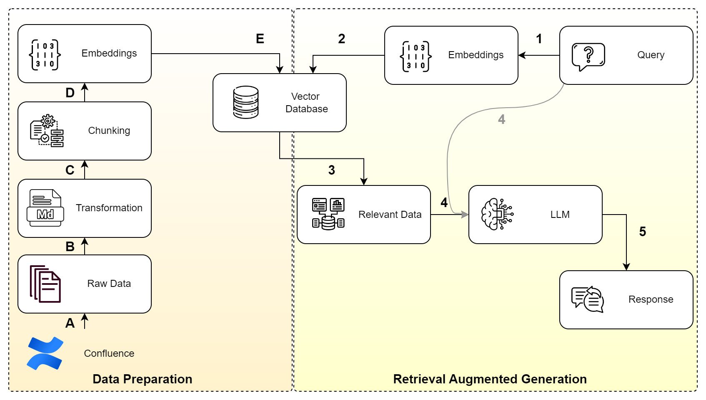
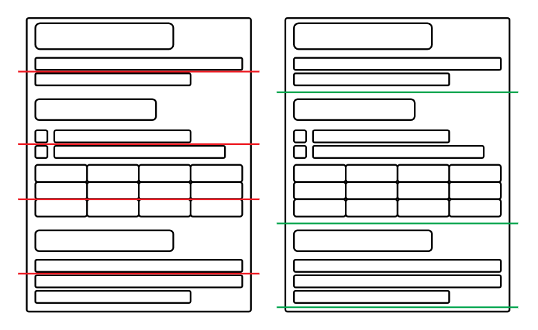

# RAG for Confluence

> Towards Enhancing Enterprise Knowledge Extraction from Confluence by using Retrieval-Augmented Generation

## Architecture

## How to use

### Credentials and Models
1. Add your Confluence credentials to ``.env``.
2. Set optionally the embedding model and the LLM you want to use for RAG in ``.env``
3. If you want to employ other embedding models not defined in ``get_embedding_function.py``, add them to the configuration.

### Environment Setup 
4. Create virtual environment: ``python -m venv venv``
5. Activate your environment: ``venv\Scripts\activate`` (i.e., Windows)
6. Install needed requirements: ``pip install -r requirements``

### Fetch and preprocess Confluence data
8. Run ``python confluence_fetcher.py`` to load your Confluence data. At this stage, it is transformed into markdown 
file, also split by sections and subsections (right) and not by fixed chunk_size (left), as shown in following picture.

### Data Embedding
9. Run ``python embed_data.py`` to embed (save vector numerical representation) of your Confluence data in the Chroma 
vector database. The data will be saved as title of (sub)section with its content alongside with the link to Confluence
page. This link will be incorporated in the response to enhance its transparency and reliability.

### Ask your RAG Confluence
10. Run ``rag.py`` after adding your query there.  

## Evaluation of RAG against Confluence search engine

- To best evaluate both systems against each other: 
  - create a list of queries paraphrased (to test for semantic search capability) for both.
  - send queries to RAG and also to Confluence. 
  - assign scores for the search results and run scripts as explained in more details in ``rag-vs-confluence`` [README](rag-vs-searchengine/README.md)